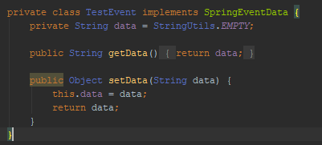

# Interfaces fonctionnelles & Synchronisation des transactions par Event

## Pourquoi

- Diminuer les cas de deadlock dûes aux appels d’API simultanés
- Eviter les erreurs fonctionnelles faux positifs (erreur API car données pas encore persistées)
- C’est sympa d’apprendre quelque chose de nouveau
- L’application n’était pas assez compliqué techniquement

## Kesako

### Généralité
- Définissent la signature d’une méthode qui pourra être utilisée pour passer en paramètre :
- Une référence vers une méthode d’instance
- Une référence vers une méthode statique
- Une expression lambda
- Une référence vers un constructeur

Les plus connues et celles proposées dans la JDK 1.8 :

|   Interface   | Prend Argument | type argument | Possède résultat | type résultat |     Méthode     |
|:-------------:|:--------------:|:-------------:|:----------------:|:-------------:|:---------------:|
|   CONSUMER    |      Oui       |       R       |       Non        |      NA       | void accept(T)  |
| FUNCTION<T,R> |      Oui       |       T       |       Oui        |       R       | void accept(T)  |
|   SUPPLIER    |      Non       |      NA       |       Oui        |       T       |     T get()     |
|   PREDICATE   |      Oui       |       R       |       Oui        |    Boolean    | boolean test(T) |

Nous pouvons aussi créer des interfaces fonctionnelles « maison », mais ça ne sera pas abordé ici.

### Donnée transmise dans l'évènement

### Implémentation des interfaces fonctionnelles

### Exécution de l'opération de l'interface fonctionnelle

## Synchronisation des transactions par Spring au travers des event
### Vision fonctionnelle

### Vision technique
#### schéma d'utilisation des briques techniques

#### diagramme d'utilisation

