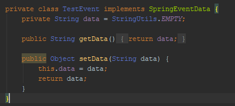
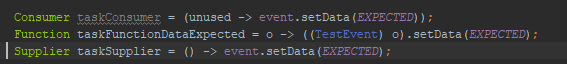
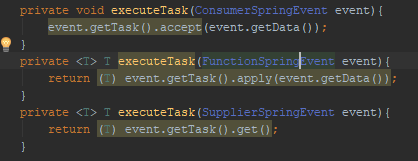
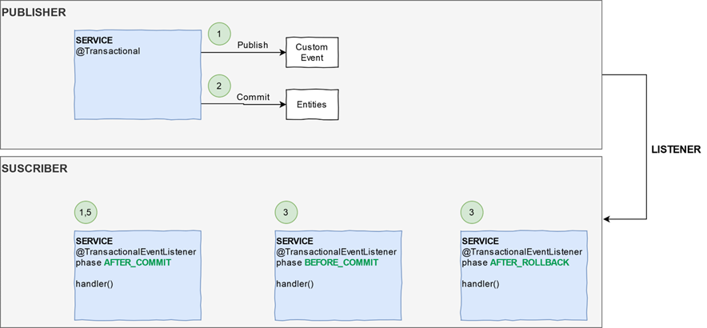
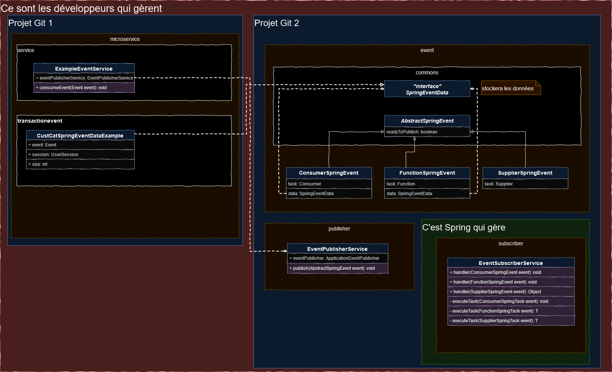
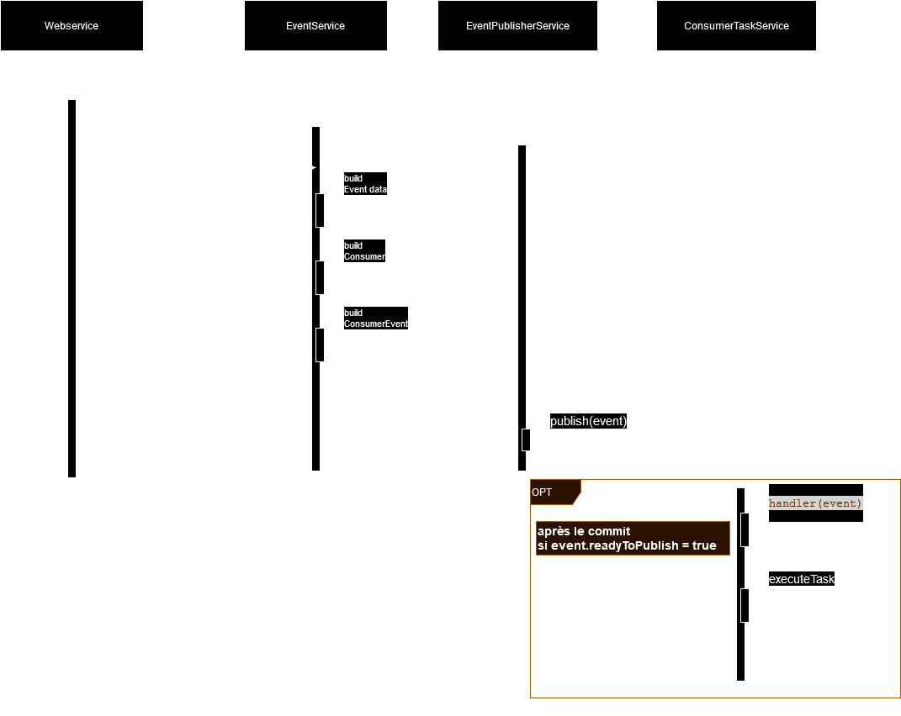

# Interfaces fonctionnelles & Synchronisation des transactions par Event

## Pourquoi

Diminuer les cas de deadlock dûes aux appels d’API simultanés

Eviter les erreurs fonctionnelles faux positifs (erreur API car données pas encore persistées)

C’est sympa d’apprendre quelque chose de nouveau

L’application n’était pas assez compliqué techniquement

## Kesako

### Généralité
- Définissent la signature d’une méthode qui pourra être utilisée pour passer en paramètre :
- Une référence vers une méthode d’instance
- Une référence vers une méthode statique
- Une expression lambda
- Une référence vers un constructeur

Les plus connues et celles proposées dans la JDK 1.8 :

|   Interface   | Prend Argument | type argument | Possède résultat | type résultat |     Méthode     |
|:-------------:|:--------------:|:-------------:|:----------------:|:-------------:|:---------------:|
|   CONSUMER    |      Oui       |       R       |       Non        |      NA       | void accept(T)  |
| FUNCTION<T,R> |      Oui       |       T       |       Oui        |       R       | void accept(T)  |
|   SUPPLIER    |      Non       |      NA       |       Oui        |       T       |     T get()     |
|   PREDICATE   |      Oui       |       R       |       Oui        |    Boolean    | boolean test(T) |

Nous pouvons aussi créer des interfaces fonctionnelles « maison », mais ça ne sera pas abordé ici.

### Donnée transmise dans l'évènement

### Implémentation des interfaces fonctionnelles

### Exécution de l'opération de l'interface fonctionnelle

## Synchronisation des transactions par Spring au travers des event
### Vision fonctionnelle

### Vision technique
#### schéma d'utilisation des briques techniques

#### diagramme d'utilisation

